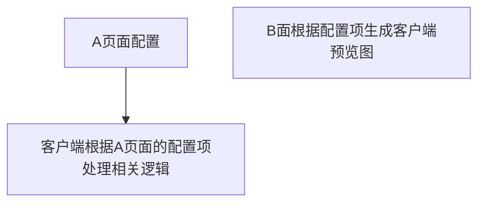

*最近又有个需求需要后台配置功能项，客户端根据配置展示布局，大概需求是这样的*


> 是客户端现在页面都是写好了的，不想再基于客户端页面查询写一套预览页面而且预览页面，根据这个点，就衍生出一个技术需求，怎么把现有页面复制成静态模板页面（最好是能解析外链CSS的）大概是这样子的


```html
<!DOCTYPE html>
<html lang="en">
    <head>
        <meta charset="UTF-8">
        <meta name="viewport" content="width=device-width, initial-scale=1.0">
        <title>Document</title>
        <style>
            .warp {
                display: block;
            }
        </style>
    </head>
    <body>
        <div class="warp"></div>
    </body>
</html>
```

> 于是我就开始疯狂Google 百度找成熟的轮子能实现一键复制页面的脚本，在我寻找下终于找到一个Google插件叫`[RunJS Collect - 组件收藏神器，程序员版Pinterest](https://runjs.work/article/dfb098)` 我心想这不就是我梦中情件嘛怀着激动心安装了这个插件


 


> WHAT?此时我就感觉到了事情不简单（不会要会员吧？）于是我就注册了

 

>于是我开开心心点了get Code 确实是获取到了，但是在点了好几次之后 


> ?????  好家伙这么玩是吧？好好好 这么点功能还要收费，于是我决定！！！自己写！！！


## 异步获取 HTML 并处理

- **函数名称**: `getHtml()`
- **功能**: 
    - 克隆整个 HTML 树。
    - 创建一个 style 元素用于存储过滤后的 CSS 规则。
    - 判断选择器是否匹配元素，包括带有 Shadow DOM 的元素。
    - 过滤 CSS 规则。
    - 异步获取外部样式表并过滤其中的规则。
    - 获取并过滤所有样式表。
    - 将过滤后的样式表添加到 style 元素中。
    - 移除 HTML 中的 script 和 link 元素。
    - 克隆目标 HTML 树并添加过滤后的样式表。
    - 压缩 HTML 并输出。

## 函数解释

- **`hasElement(selector, el)`**: 
    - 判断选择器是否匹配元素，包括带有 Shadow DOM 的元素。
- **`filterCssRules(cssRules, target)`**: 
    - 过滤 CSS 规则，判断当前规则的选择器是否匹配元素或者是否包含伪类，是则添加到 filteredCss 中。
- **`fetchAndFilterExternalStyleSheet(href, target)`**: 
    - 异步获取外部样式表并过滤其中的规则。
- **`getStyleSheet()`**: 
    - 获取并过滤所有样式表。
- **`getHtml()`**: 
    - 异步获取 HTML 并处理，克隆整个 HTML 树，创建并添加过滤后的样式表，移除 script 和 link 元素，克隆目标 HTML 树并添加过滤后的样式表，最后输出压缩后的 HTML。

- **函数封装**: 

```js
    // 判断选择器是否匹配元素，包括带有 Shadow DOM 的元素
    function hasElement(selector, el) {
        return el.querySelector(selector) !== null || [...el.querySelectorAll(selector)].some(el => el.shadowRoot);
    }

    // 过滤 CSS 规则
    function filterCssRules(cssRules, target) {
        let filteredCss = '';
        for (const rule of cssRules) {
            if (rule.type === 1) { // CSSRule.STYLE_RULE
                // 判断当前规则的选择器是否匹配元素或者是否包含伪类，是则添加到 filteredCss 中
                if (hasElement(rule.selectorText, target) || rule.selectorText === ':root' || rule.selectorText.includes(':')) {
                    filteredCss += `${rule.cssText}\n`;
                }
            } else if (rule.type === 4) { // CSSRule.MEDIA_RULE
                // 如果是媒体查询规则，则根据条件匹配进行进一步过滤
                const mediaQuery = window.matchMedia(rule.conditionText);
                if (mediaQuery.matches) {
                    filteredCss += filterCssRules(rule.cssRules, target);
                }
            }
        }
        return filteredCss;
    }

    // 异步获取外部样式表并过滤其中的规则
    async function fetchAndFilterExternalStyleSheet(href, target) {
        const response = await fetch(href);
        if (!response.ok) return '';
        const text = await response.text();
        const styleSheet = new CSSStyleSheet();
        styleSheet.replaceSync(text);
        return filterCssRules(styleSheet.cssRules, target);
    }


    // 获取并过滤所有样式表
    async function getStyleSheet() {
        let filteredCss = '';
        for (const styleSheet of document.styleSheets) {
            if (styleSheet.href && !styleSheet.href.includes(window.location.origin)) {
                // 如果是外部样式表，则异步获取并过滤
                const filtered = await fetchAndFilterExternalStyleSheet(styleSheet.href, target);
                if (filtered) {
                    filteredCss += filtered;
                }
            } else {
                // 否则直接过滤内联样式表
                filteredCss += filterCssRules(styleSheet.cssRules, target);
            }
        }
        return filteredCss;
    }
```
>实现复制这个网站


>复制结果


>最终效果
>图标以及图片静态资源未作处理需要处理自己添加相关逻辑
>后期我会补上静态资源逻辑 并写成Google插件 免费开源
>脚本源码自取·123132·


